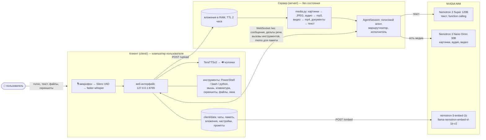
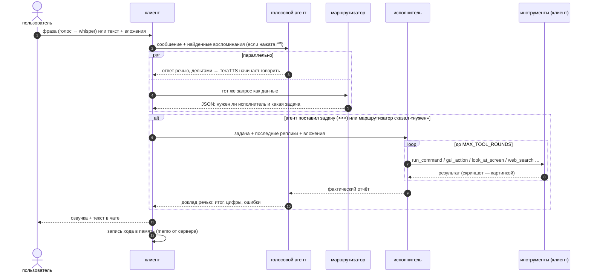
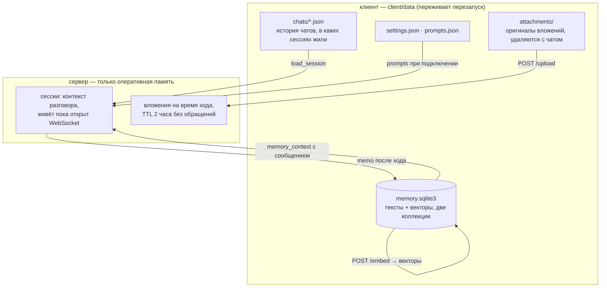

# NemoAgent

Голосовой и текстовый агент из двух частей.

- **Сервер** (`server/`) — тонкий слой над NVIDIA NIM: `nvidia/nemotron-3-super-120b-a12b` для всего
  текстового (голосовой агент, исполнитель с function calling, маршрутизатор) и
  `nvidia/nemotron-3-nano-omni-30b-a3b-reasoning` для всего, где есть картинки, аудио или видео.
  Ничего не хранит: один сервер обслуживает сколько угодно клиентов параллельно.
- **Клиент** (`client/`) на машине пользователя: микрофон → faster-whisper, TeraTTSv2 → колонки, локальный
  веб-интерфейс, исполнение команд и управление компьютером, история чатов, долговременная память (RAG) и
  вложения — всё в `client/data`.



## Что умеет

- **Голосовой диалог без рук**: VAD сам находит начало и конец фразы, распознаёт на GPU за ~0.3 с, ответ
  модели начинает звучать по первому же предложению, пока модель дописывает остальное. Можно перебить
  голосом (barge-in) — озвучка и генерация останавливаются.
- **Текст, файлы, картинки, аудио, видео, скриншоты** из локального веб-интерфейса (drag&drop, Ctrl+V,
  кнопка 🖥). Вложения кладутся прямо в сообщение (`image_url`, `audio_url`, `video_url` с base64), и
  голосовой агент сразу отвечает по ним — описывает, читает текст, транскрибирует запись, пересказывает
  ролик — без вызова инструментов. Документы (PDF, DOCX, PPTX, XLSX, текст и код) подаются текстом;
  страницы PDF без текстового слоя — картинками. Скриншот снимается с выбранных в настройках мониторов
  (по умолчанию со всех, по картинке на каждый).
- **Управление компьютером** через function calling у исполнителя: `run_command` (PowerShell/cmd на
  Windows, bash/zsh/sh на Linux и macOS), `run_python`, файлы, `gui_action` (мышь/клавиатура),
  `open_target`, буфер обмена, окна, `system_info`, `look_at_screen` (скриншот возвращается исполнителю
  как картинка — он сам видит экран и кликает по координатам), `view_attachments` (показать себе вложения
  ещё раз). Опасные команды требуют подтверждения в интерфейсе (`TOOL_CONFIRM=dangerous|always|never`).
- **Веб**: `web_search` и `fetch_page` (текст страницы без разметки). Поиск идёт через API, если в
  `server/.env` есть ключ `TAVILY_API_KEY`, `BRAVE_SEARCH_API_KEY` или `SERPER_API_KEY` (у всех есть
  бесплатные тарифы); без ключа используется RSS-лента Bing — она отдаёт настоящие ссылки, но по
  русским запросам слабая (HTML-страницы поисковиков скрипту не отдаются: капчи и подставные
  результаты). При необходимости прокси в `WEB_PROXY`.
- **Долговременная память (RAG по прошлым диалогам)**: каждый обмен репликами клиент кладёт в свою базу
  (`client/data/memory.sqlite3`), векторы считает сервер моделью `nvidia/nemotron-3-embed-1b`; ходы с
  картинками (вопрос + ответ + сами картинки как data-URI) — моделью `nvidia/llama-nemotron-embed-vl-1b-v2`
  в отдельной коллекции, так что их можно найти и по тексту, и по похожему изображению. Память включается
  кнопкой 🗂 в интерфейсе: пока она нажата, клиент ищет релевантные воспоминания и отправляет их вместе с
  сообщением, а исполнителю доступен `search_memory` (тоже через клиента); выключена — модель отвечает
  только по текущему диалогу. Живой контекст держится в бюджете `CONTEXT_BUDGET_TOKENS` (по умолчанию 60k):
  старые ходы уходят из контекста, но остаются в памяти; медиа старше `MEDIA_KEEP_TURNS` (двух) ходов
  заменяются текстовой пометкой, чтобы не гонять мегабайты в каждом запросе.

## Как устроен один ход

Для разговора function calling не используется. Работают три роли на одной модели (Nemotron 3 Super 120B,
у каждой роли свой промпт, все редактируются во вкладке «Системные промпты»); как только в запросе есть
картинка, аудио, видео или скриншот, вызов уходит в Nano Omni.



1. **Голосовой (диалоговый) агент** без инструментов. Видит и слышит вложения сам. Отвечает пользователю
   сразу, в речевом формате: только слова, числа и единицы прописью в нужном падеже («двадцать четыре
   целых девять десятых гигабайта»), аббревиатуры раскрыты, названия транслитерированы («Виндоус»,
   «Гитхаб»), короткие фразы, буква ё, `+` в омографах, без дежурных концовок. Если нужен код, команда,
   путь или ссылка, он говорит об этом словами, а точный текст ставит после строки `===` (только на
   экран). Если запрос требует действия или информации, которой у него нет (проверить, запустить,
   открыть, найти, посмотреть на экран сейчас, поискать в интернете, вспомнить), он говорит одну фразу о
   том, что сейчас сделает («Сейчас проверю место на диске»), и ставит задачу строкой `>>>` с точным
   описанием. Ответ стримится клиенту как речь по мере генерации (`speechfmt.ProseSpeechRouter`),
   последние семьдесят символов придерживаются, чтобы отрезать «Чем могу помочь?».
2. **Маршрутизатор** работает параллельно с ответом: читает сам запрос пользователя (как данные, не как
   команду) и отвечает одной строкой JSON — нужен ли исполнитель и какая у него задача. Если голосовой агент
   не поставил `>>>`, а маршрутизатор сказал «нужен», задача берётся у него (в чате пометка). Вложения
   маршрутизатор считает уже увиденными: вопрос «что на скриншоте» исполнителя не требует. Резервная
   страховка — эвристика по тексту ответа: короткая фраза «Сейчас…/Секунду…» или обещание с глаголом в
   будущем времени превращает запрос пользователя в задачу.
3. **Внутренний исполнитель** получает задачу, последние реплики диалога и вложения текущего сообщения,
   выполняет задачу инструментами и возвращает фактический отчёт. Первый раунд идёт с `tool_choice=auto`;
   если модель ответила словами без единого вызова, раунд повторяется с `required`. С пользователем не
   разговаривает. Его вызовы и результаты видны в чате и в полном логе. Скриншоты и вложения приходят ему
   картинками отдельным сообщением сразу после результата инструмента. За ход допускается до двух задач
   подряд (например, проверить, а потом исправить).
4. **Голосовой агент докладывает**: получает «Результат исполнителя» как сообщение и озвучивает итог,
   цифры, ошибки; если вместо итога снова обещает — переспрашивается ещё раз.

### Почему речь готовится на сервере

TeraTTSv2 знает всего 134 символа: буквы, пробел и знаки `. , ! ? : ; - ( ) « » " '`. Цифры она
разворачивает только в именительном падеже, а `%`, `°`, `№`, `—`, `…`, пути, ссылки и аббревиатуры («ГБ»,
«ПК») либо выбрасывает, либо читает по буквам. Поэтому голосовой агент пишет сразу «речью», а клиент
добавляет свой слой: фильтр по словарю движка (тире и многоточия становятся паузами, `%`/`№`/`°` словами),
чистка markdown, скруббер кода (команда или путь в речи заменяется на «команда на экране»), раскрытие чисел,
дробей, дат (15.09.2026) и времени (15:02) в русские слова, транслитерация латинских слов в русском
предложении (`translit.py`: «futuristic» → «футуристик», «GTA» → «джи-ти-эй») и обход особенности рантайма,
из-за которой один ручной `+` отключал автоударения во всём предложении. Целиком английские фразы
озвучивает английский голос.

## Замеры

RTX 4070 Ti SUPER, Windows 11, бесплатный пул NIM (`integrate.api.nvidia.com`), вечер по Москве,
reasoning выключен. Первый токен — от отправки запроса до первого символа ответа.

| этап | результат |
|---|---|
| STT faster-whisper large-v3-turbo (CUDA fp16), фраза ~3 с | ~0.3 с |
| Super 120B, короткий ответ (6 запросов) | первый токен 1.5–1.7 с (медиана 1.65 с, один запрос из шести — 5.3 с) |
| Super 120B, ответ в абзац (4 запроса) | первый токен 1.6–2.3 с (медиана 2.0 с), весь ответ 4.4 с |
| Super 120B как маршрутизатор, строка JSON (6 запросов) | первый токен 1.5 с, вердикт целиком 1.7 с (все шесть без пустых потоков) |
| Nano Omni, короткий текстовый ответ (6 запросов) | первый токен 1.5–1.6 с |
| Nano Omni, скриншот 1600×900 (~1600 токенов) + вопрос (5 запросов) | первый токен 2.4–2.5 с, ответ целиком 2.6 с |
| Nano Omni, 40-секундное видео 720p (запрос 19 МБ, ~6800 токенов) | ~18 с (замер раньше, тем же способом) |
| эмбеддинг одного хода (`nemotron-3-embed-1b`) | 0.14 с (максимум 0.26 с) |
| первый звук TeraTTSv2 после появления первого предложения | 0.2–0.3 с (CUDA), 0.5–0.8 с (CPU) |

Итого от конца фразы до первого звука ответа обычно две-три секунды: STT, первый токен Super, синтез первого
предложения. Главная беда бесплатного пула не задержка, а пустые потоки: шлюз отвечает 200 и тут же закрывает поток без единого токена. В этом прогоне у Super так закончились 2 запроса из 16, у Omni — 6 из 11. Сервер замечает пустой поток и повторяет запрос, так что в интерфейсе это выглядит как лишние две-три секунды ожидания, а не как ошибка.

Модель можно переключить на `nvidia/nemotron-3.5-lightning-30b-a3b` в настройках (голосовой агент,
исполнитель, маршрутизатор — по отдельности); замеров для неё здесь нет, по умолчанию она не используется.

## Установка

Нужен Python 3.11 (сервер — любой ≥3.10). Клиенту для GPU нужна NVIDIA-карта с драйвером CUDA 12+
(все CUDA-библиотеки ставятся pip'ом, отдельный CUDA Toolkit не нужен). Без GPU всё работает на CPU.

### Сервер

```bash
cd server
copy .env.example .env      # и заполнить
run_server.bat              # Windows (создаст .venv и поставит зависимости)
./run_server.sh             # Linux/macOS
```

В `server/.env`:

- `AGENT_TOKEN` — общий секрет клиента и сервера (любая длинная строка);
- `NVIDIA_API_KEY` — ключ NIM с build.nvidia.com;
- `LLM_MODEL` — серверное умолчание для голосового агента и исполнителя (Nemotron 3 Super 120B),
  `ROUTER_MODEL` — для маршрутизатора (он же), `LLM_MEDIA_MODEL` — для вызовов с картинками/аудио/видео
  (Nano Omni). Клиент переопределяет каждую роль из настроек. Выбор происходит на каждый вызов: пока в
  контексте есть медиа последних двух ходов или скриншот исполнителя, работает медиа-модель, иначе модель
  роли;
- `FFMPEG` — путь к ffmpeg (или просто `ffmpeg`, если он в PATH). Он конвертирует любые аудио и видео в то,
  что принимает модель (mp3 моно, mp4 ≤ 2 минут, ≤ 480p, 4 к/с). Без ffmpeg как есть уходят только wav,
  mp3 и mp4; остальные форматы модель не получит;
- `MEDIA_*` — ограничения на вложения (сторона картинки, длительность аудио/видео, страницы PDF, сколько
  последних ходов держат медиа в контексте);
- `UPLOAD_TTL_S` — сколько секунд вложение живёт в памяти сервера без обращений (2 часа);
- `WEB_PROXY` — прокси для `web_search`/`fetch_page`, если нужен.

Сервер слушает `0.0.0.0:8700`: `GET /health`, `POST /upload`, `POST /embed`, `WS /ws` (протокол описан в
`server/nemoagent_server/main.py`).

### Клиент

```bash
cd client
copy .env.example .env      # SERVER_URL и тот же AGENT_TOKEN
run_client.bat              # Windows (создаст .venv, поставит зависимости)
./run_client.sh             # Linux/macOS
python download_models.py   # TeraTTSv2 (~1.2 ГБ) в client/models и whisper (~1.6 ГБ) в кэш HF
```

Клиент поднимает интерфейс на <http://127.0.0.1:8765> и открывает его в браузере. Статусные метки
показывают, загрузились ли STT/TTS и подключён ли сервер; внизу — уровень микрофона и задержки
(STT, первый токен, первый звук).

## Интерфейс

Три колонки: слева список (чаты или воспоминания), в центре вкладки, справа настройки. Боковые колонки
прячутся кнопками ☰ и ⚙, но центр при этом не двигается.

Вкладки: **Чат**, **Системные промпты**, **Память**, **Полные логи** (каждый запрос к модели целиком:
системный промпт, история, вызовы инструментов и их результаты; каждый ответ с usage и временем; base64
медиа в логе заменены на их размер) и **Озвучка**.

Левая панель есть только у двух вкладок. У **Чата** — история чатов: каждый диалог сохраняется на
клиенте (`client/data/chats/*.json`) с названием из первого сообщения; щелчок открывает старый чат и
возвращает модели его реплики, так что разговор можно продолжить; «+ новый» начинает новый диалог, красная
«Очистить чат» внизу стирает текущий. Удаление чата (✕ или «Очистить чат») стирает и его записи из
долговременной памяти, и его вложения. У **Памяти** — список воспоминаний с датой и видом (и оценкой
близости после поиска по смыслу); выбранное открывается в основной области: текст правится на месте
(эмбеддинг пересчитывается), запись удаляется; «+ новое» добавляет запись руками (вид «заметка»); внизу
«Прибраться в памяти» (пустяковые и повторяющиеся записи) и красная «Очистить память» (всё, необратимо).

Во вкладке «Системные промпты» пять редактируемых полей: шаблон промпта голосового агента (подстановки
`{env}` — окружение и текущее время, `{voice_style}` — стиль по режиму), правила речи для голосового
режима, стиль текстового режима, промпт внутреннего исполнителя и промпт маршрутизатора. «Сохранить»
запоминает правки на клиенте (`client/data/prompts.json`) и передаёт серверу для текущей сессии; они
действуют со следующего сообщения и переживают перезапуск; «Сбросить к умолчанию» возвращает встроенные
тексты (`server/nemoagent_server/prompts.py`). Ниже показан ровно тот промпт, который ушёл в модель в
последнем запросе.

Вкладка **Озвучка** — читалка: любой по размеру текст (вставить, набрать или надиктовать) и кнопка
«Озвучить». Читает тот же TeraTTS теми же голосами и темпом, по предложениям, с прогрессом и текущей фразой;
выделенный фрагмент читается отдельно; «Стоп» обрывает мгновенно. Диктовка 🎙 включает прослушивание и
направляет распознанные фразы в текст, а не агенту; текст хранится в браузере.

В **настройках**: модель на каждую роль (голосовой агент, исполнитель, маршрутизатор — Super 120B по
умолчанию, можно переключить на Lightning 30B; медиа-роль — Nano Omni, единственная мультимодальная модель
бесплатного пула), режим озвучки, **язык озвучки** («авто» — по тексту предложения, «русский» — всё
по-русски, латиница транслитерируется, «английский» — латиница и числа английским голосом), голоса
`ru_*`/`eng_*`, темп, устройство вывода и микрофон (переключаются на лету; видно, куда сейчас идёт звук),
автопрослушивание, barge-in, язык распознавания, разрешение управлять компьютером, режим подтверждений,
**мониторы для скриншота** (все, один или набор). «Проверить голос» озвучивает фразу на языке выбранной
озвучки без участия сервера. Виртуальные устройства вроде FxSound работают только пока запущено их
приложение, при тишине выберите физические колонки или наушники.

Род агента следует выбранному голосу: с женским голосом (`ru_f*`, `eng_f*`) он говорит о себе «готова,
сделала», с мужским (`ru_m*`, `eng_m*`) — «готов, сделал»; при смене голоса посреди разговора сервер
вставляет в историю заметку о смене рода. У каждого сообщения в чате есть 🔊: нажатие озвучивает его заново
(у ответов агента — ту версию, что звучала).

В чате: Enter — отправить, 📎 файлы, 🖥 скриншот в вложение, 🗂 память (RAG) для следующих сообщений,
🎙 push-to-talk (держать кнопку или пробел вне поля ввода), 👂 автопрослушивание (VAD), ■ остановить.
Перебивание голосом (barge-in): пока агент говорит, детектор речи работает с повышенным порогом и требует
более длинного отрезка речи (около полсекунды), после чего озвучка и генерация останавливаются, а фраза
распознаётся и уходит в диалог. Проверки на эхо нет: если микрофон ловит колонки, выключите barge-in в
настройках или используйте наушники.

## Где что хранится



Один сервер обслуживает много клиентов параллельно (одна сессия на соединение) и прячет вызовы NIM; всё,
что должно пережить перезапуск, хранится у клиента. Не попавшие ни в один чат вложения удаляются через
`ATTACHMENT_KEEP_HOURS`; каталог данных можно перенести через `CLIENT_DATA_DIR`.

## Как это устроено

**server/nemoagent_server**

- `nim.py` — стриминговый клиент NIM с инструментами: повтор при перегрузке пула (500/503/529, «[ERROR: …]»
  в теле ответа, пустой оборвавшийся поток), детектор зацикливания («ellsellsells» до `max_tokens`),
  откат неподдерживаемых параметров; reasoning выключается через `chat_template_kwargs.enable_thinking`;
  эмбеддинги.
- `agent.py` — сессия: системный промпт (включая ОС/оболочку/экран клиента), ход из трёх ролей
  (диалог ∥ маршрутизатор → задача → исполнитель с циклом инструментов до `MAX_TOOL_ROUNDS` → доклад),
  вложения как части сообщения, воспоминания от клиента, обрезка контекста, прерывание, выбор модели по
  роли и по наличию медиа.
- `media.py` — подготовка вложений для модели: картинки → JPEG ≤ 1600 px, аудио → mp3 (ffmpeg), видео →
  mp4 ≤ 2 мин (ffmpeg), PDF → текст по страницам (PyMuPDF) или картинки страниц, DOCX/PPTX/XLSX → текст из
  XML, текстовые файлы как есть; всё из памяти, без временных файлов на диске сервера кроме ffmpeg.
- `tools.py` — схемы всех инструментов; серверные реализации (`view_attachments`, `look_at_screen`,
  `web_search`, `fetch_page`, `get_current_time`, `calculate`, `get_weather`); клиентские только описаны —
  их исполняет клиент (`search_memory` тоже). Инструмент может вернуть `_media` — части сообщения, которые
  агент подставит модели следом за результатом (так исполнитель видит скриншот).
- `prompts.py` — промпты трёх ролей и правила речи; переопределения приходят от клиента и живут только в
  его сессии.
- `attachments.py` — вложения в оперативной памяти со сроком жизни `UPLOAD_TTL_S`.
- `speechfmt.py` — разбор речевого ответа на лету: речь / экранная часть после `===` / задача `>>>`,
  срез дежурных концовок, детектор обещаний.

**client/nemoagent_client**

- `core.py` — оркестратор: WebSocket к серверу с автопереподключением, локальный UI-хаб, история чатов,
  память, вложения, подтверждения, переключение аудиоустройств, настройки.
- `memory.py` — долговременная память: SQLite + numpy-косинус, две коллекции (`text`, `vl`), поиск обоих
  эмбеддингов параллельно; векторы считает сервер по `/embed`.
- `audio_in.py` — микрофон 16 кГц (WASAPI с проверкой, что кадры реально идут), Silero VAD (ONNX, без
  torch), пред-буфер, push-to-talk, barge-in с повышенным порогом, пока агент говорит; `stt.py` —
  faster-whisper с фильтром галлюцинаций.
- `tts.py` — TeraTTSv2 напрямую через ONNX Runtime (CUDA → CPU), разметка `<ru>/<en>` по словам, выбор
  голоса по языку предложения, чистка markdown/эмодзи, `SentenceSplitter` для потока дельт.
- `speech.py` + `player.py` — очередь предложений, синтез в отдельном потоке, ленивый `OutputStream`,
  мгновенная отмена по поколению.
- `executor.py` — инструменты управления компьютером, детектор опасных команд, скриншоты (`mss`) по
  мониторам с пересчётом координат для `gui_action`.

## Память: гигиена

Короткие обмены («Проверка.» / «Спасибо») в память не пишутся, дубликаты тоже; порог релевантности для
подмешивания 0.5 (`MEMORY_MIN_SCORE` в `client/.env`, там же `MEMORY_TOP_K`). Если память засорилась, во
вкладке «Память» есть «Прибраться в памяти» (пустяковые и повторяющиеся записи) и «Очистить память»
(всё); удаление чата стирает и его записи.

## Ограничения и заметки

- Обе модели официально «English-first», но по-русски отвечают, а Omni ещё и транскрибирует русскую речь
  (проверено); reasoning выключен по умолчанию (`LLM_THINKING=false`) ради задержки, включается в `.env`
  (тогда `LLM_TEMPERATURE=0.6`, как советует карточка модели).
- Бесплатный пул NIM общий и маленький (у Omni — 16 одновременных запросов на воркер): в час пик шлюз
  отвечает 503 «Worker local total request limit reached» или закрывает поток пустым. Сервер повторяет
  запрос сам, но ответ по картинке может прийти через десятки секунд. Пустые потоки у Omni случаются заметно чаще, чем у Super (в замере выше — каждый второй запрос).
- Лимиты Omni: видео до 2 минут (сервер сам режет и ужимает), аудио до часа (сервер режет до
  `MEDIA_AUDIO_MAX_S`, по умолчанию 20 минут), картинка 1600 px ≈ 1600 токенов, 90 с речи ≈ 1100 токенов,
  40 с видео ≈ 6800 токенов. Запрос в 19 МБ проходит; `MEDIA_MAX_INLINE_MB` (24) — потолок на один файл.
- Super 120B — только текст: любой вызов с медиа автоматически уходит в Omni, а старые медиа заменяются
  пометкой, чтобы текстовые ходы не тащили за собой картинки.
- `web_search` без ключа берёт RSS-ленту Bing (`websearch.py`): результаты бывают лишь отдалённо по теме,
  исполнителю об этом сообщается, и он открывает страницы через `fetch_page`. Для нормального поиска
  положите в `.env` бесплатный ключ Tavily, Brave или Serper.
- `gui_action` работает по координатам из `look_at_screen` (кадр скриншота); если `SCREENSHOT_MAX_SIDE`
  уменьшает скриншот, клиент сам пересчитывает координаты обратно в пиксели экрана. При нескольких
  мониторах `look_at_screen` возвращает по картинке на каждый, а `gui_action` получает номер монитора,
  в кадре которого заданы координаты. Мониторы для скриншота выбираются в настройках (начальное значение —
  `SCREENSHOT_MONITORS` в `client/.env`).
- Список окон/фокус (`list_windows`) есть только на Windows; остальное кроссплатформенно.
