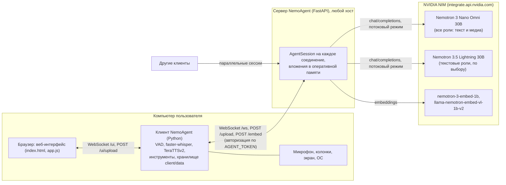
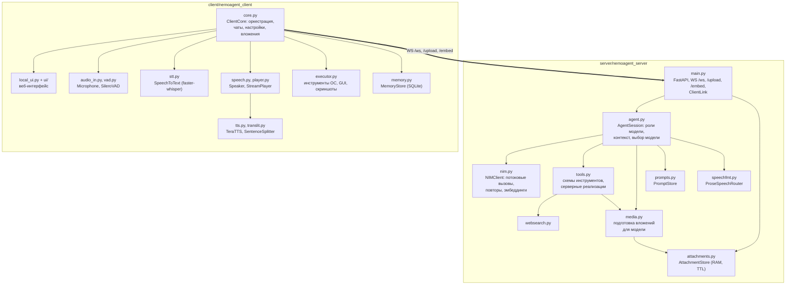
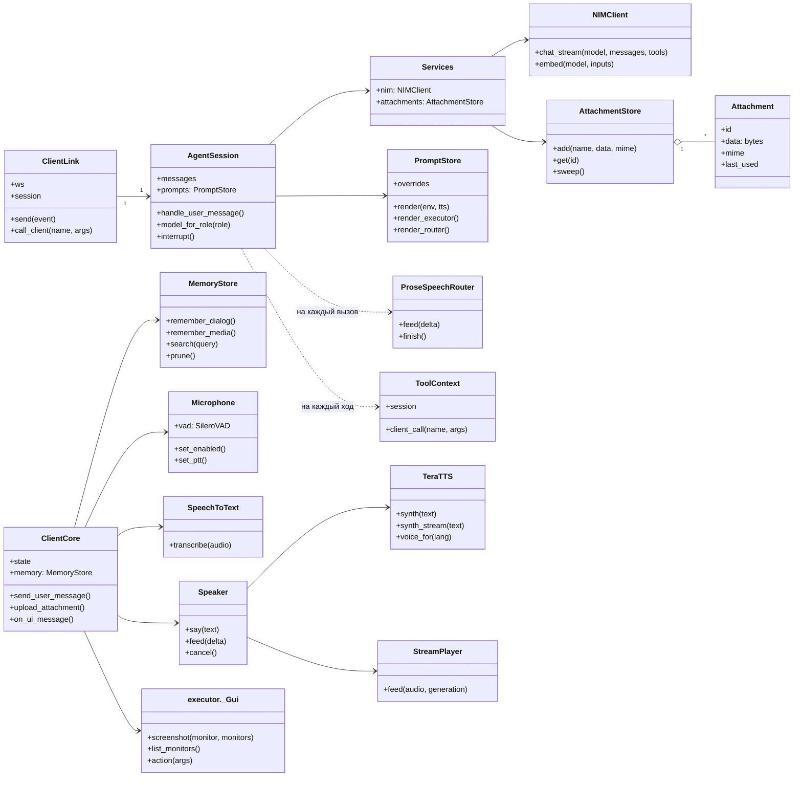
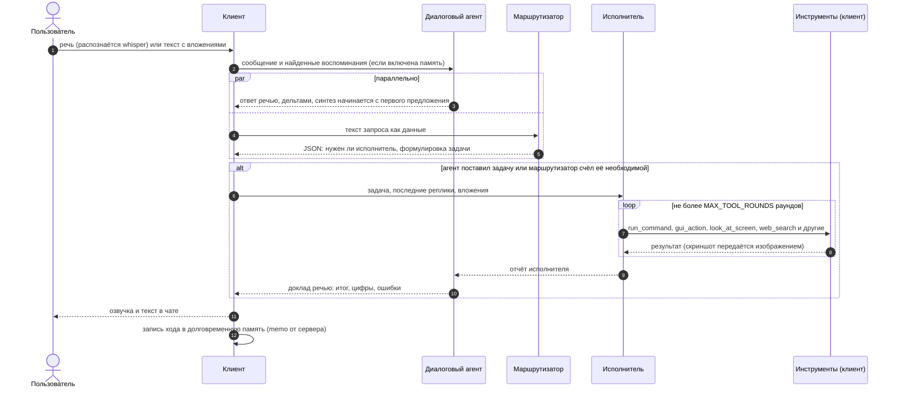
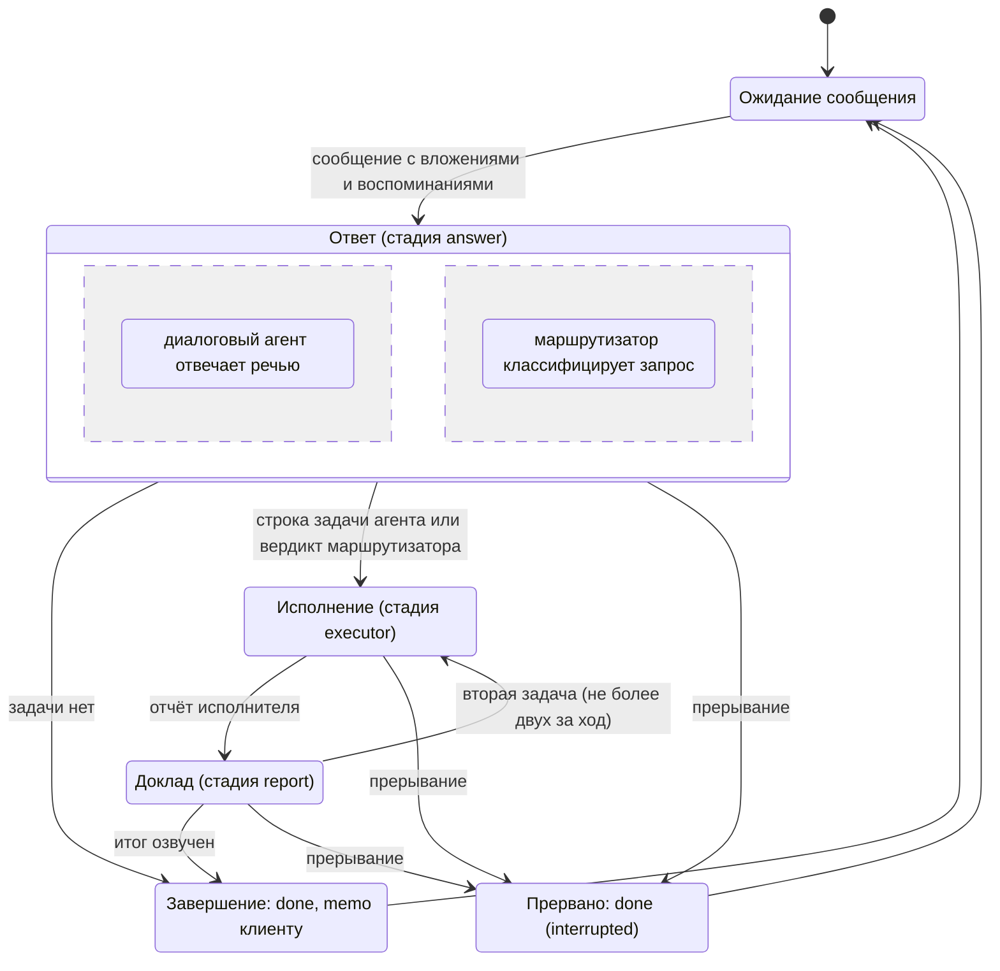
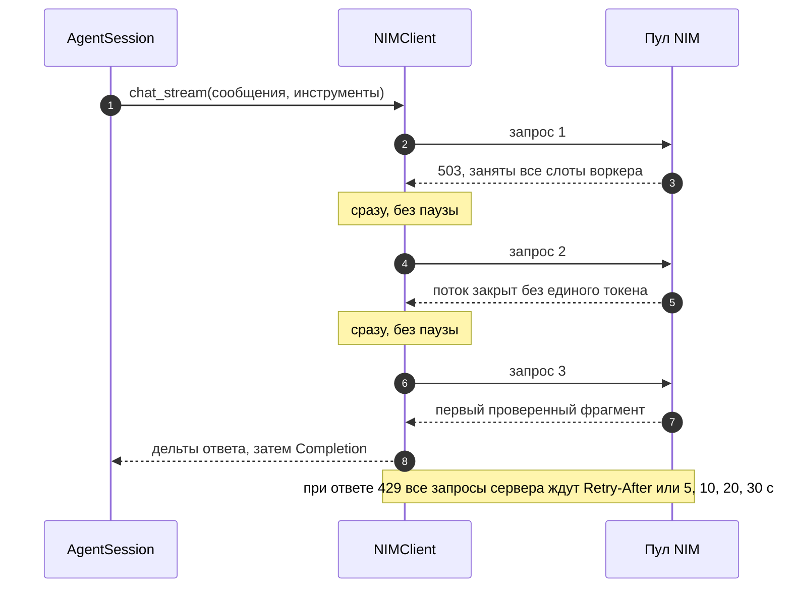
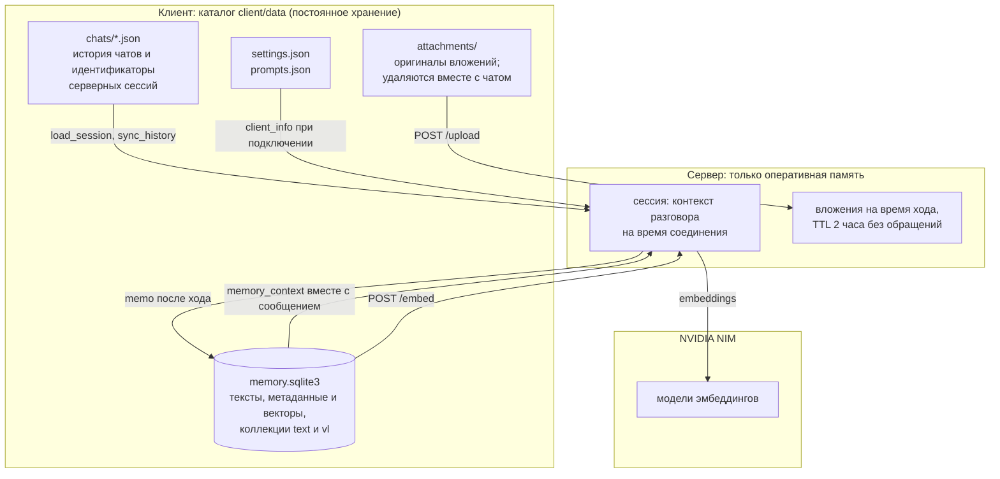

# NemoAgent

NemoAgent представляет собой голосового и текстового ассистента с управлением компьютером, построенного по схеме
«тонкий сервер, толстый клиент». Сервер скрывает от клиента работу с языковыми моделями NVIDIA NIM и не хранит
состояния между сеансами; клиент выполняется на компьютере пользователя и отвечает за распознавание речи,
синтез речи, исполнение команд, историю диалогов и долговременную память.

## Содержание

1. [Назначение и состав](#1-назначение-и-состав)
2. [Архитектура](#2-архитектура)
   - [2.1. Диаграмма развёртывания](#21-диаграмма-развёртывания)
   - [2.2. Диаграмма компонентов](#22-диаграмма-компонентов)
   - [2.3. Диаграмма классов](#23-диаграмма-классов)
3. [Обработка запроса](#3-обработка-запроса)
   - [3.1. Роли модели](#31-роли-модели)
   - [3.2. Диаграмма последовательности](#32-диаграмма-последовательности)
   - [3.3. Диаграмма состояний хода](#33-диаграмма-состояний-хода)
   - [3.4. Подготовка речевого ответа](#34-подготовка-речевого-ответа)
   - [3.5. Повторы запросов к NIM](#35-повторы-запросов-к-nim)
4. [Хранение данных](#4-хранение-данных)
   - [4.1. Диаграмма потоков данных](#41-диаграмма-потоков-данных)
   - [4.2. Долговременная память](#42-долговременная-память)
5. [Функциональные возможности](#5-функциональные-возможности)
6. [Производительность](#6-производительность)
7. [Установка и конфигурация](#7-установка-и-конфигурация)
   - [7.1. Сервер](#71-сервер)
   - [7.2. Клиент](#72-клиент)
8. [Пользовательский интерфейс](#8-пользовательский-интерфейс)
9. [Структура исходного кода](#9-структура-исходного-кода)
10. [Ограничения и особенности эксплуатации](#10-ограничения-и-особенности-эксплуатации)

## 1. Назначение и состав

Система состоит из двух приложений.

- **Сервер** (`server/`, Python, FastAPI). Принимает соединения клиентов по WebSocket, ведёт контекст
  разговора каждой сессии, вызывает модели NVIDIA NIM и исполняет серверные инструменты (просмотр
  вложений, веб-поиск, чтение страниц). Все роли по умолчанию работают на мультимодальной модели
  `nvidia/nemotron-3-nano-omni-30b-a3b-reasoning`, которая принимает текст, изображения, аудио и видео; для
  текстовых ролей можно выбрать `nvidia/nemotron-3.5-lightning-30b-a3b`. Отказавший запрос к пулу NIM
  сервер сразу повторяет (раздел 3.5). Сервер не пишет на диск и обслуживает произвольное число клиентов
  одновременно.
- **Клиент** (`client/`, Python). Захватывает речь с микрофона (Silero VAD, faster-whisper), синтезирует
  ответы (TeraTTSv2), поднимает локальный веб-интерфейс, исполняет инструменты управления компьютером,
  хранит историю чатов, вложения, настройки, правки промптов и долговременную память в каталоге
  `client/data`.

Обе части написаны на Python 3.11 и запускаются скриптами `run_server.bat`/`run_server.sh` и
`run_client.bat`/`run_client.sh`.

## 2. Архитектура

### 2.1. Диаграмма развёртывания

Рис. 1 показывает размещение компонентов по узлам и протоколы взаимодействия между ними. Клиент и браузер
находятся на одном компьютере; сервер может располагаться на любом хосте, доступном клиенту по сети; модели
предоставляются сервисом NVIDIA NIM.



*Рис. 1. Диаграмма развёртывания.*

### 2.2. Диаграмма компонентов

Рис. 2 отражает разбиение каждого приложения на модули и основные зависимости между ними. Интерфейсами
между приложениями служат три конечные точки сервера: `WS /ws` (сообщения, потоковые дельты ответа, вызовы
клиентских инструментов), `POST /upload` (вложения на время хода) и `POST /embed` (векторы для памяти
клиента).



*Рис. 2. Диаграмма компонентов.*

### 2.3. Диаграмма классов

На рис. 3 приведены основные классы обоих приложений и отношения между ними. На сервере на каждое
WebSocket-соединение создаётся объект `ClientLink`, владеющий сессией `AgentSession`; общие для всех сессий
сервисы (`NIMClient`, `AttachmentStore`) собраны в `Services`. На клиенте центральным объектом является
`ClientCore`, который владеет аудиоконвейером, исполнителем инструментов и хранилищем памяти.



*Рис. 3. Диаграмма классов (основные классы).*

## 3. Обработка запроса

### 3.1. Роли модели

Для разговора function calling не используется: вместо одного агента с инструментами работают три роли на
одной модели (по умолчанию Nano Omni), каждая со своим промптом (все промпты редактируются во вкладке
«Системные промпты»). Если для текстовой роли выбрана Lightning, а в запросе присутствуют изображение, аудио,
видео или скриншот, этот вызов всё равно выполняется мультимодальной моделью.

1. **Диалоговый агент** (в интерфейсе «Голосовой агент») инструментов не имеет. Он видит и слышит вложения
   непосредственно и отвечает сразу, в речевом формате: только слова, числа и единицы прописью в нужном
   падеже, аббревиатуры раскрыты, названия транслитерированы, короткие фразы, буква ё, знак `+` для
   ударения в омографах, без дежурных концовок. Если ответ должен содержать код, команду, путь или ссылку,
   агент называет их словами, а точный текст помещает после строки `===`; эта часть выводится на экран и не
   озвучивается. Если запрос требует действия или сведений, которых у агента нет (проверить, запустить,
   открыть, найти, посмотреть на экран, выполнить поиск в интернете, вспомнить прошлый разговор), агент
   произносит одну фразу о том, что сейчас сделает, и формулирует задачу в строке, начинающейся с `>>>`.
   Ответ передаётся клиенту потоком по мере генерации (`speechfmt.ProseSpeechRouter`); последние семьдесят
   символов удерживаются, чтобы отрезать шаблонные концовки вида «Чем ещё могу помочь?».
2. **Маршрутизатор** работает параллельно с ответом диалогового агента. Он получает текст запроса как данные
   (в кавычках, с явным указанием не выполнять его) и возвращает одну строку JSON: требуется ли
   исполнитель и какова его задача. Если диалоговый агент задачу не поставил, а маршрутизатор счёл её
   необходимой, задача берётся у маршрутизатора; в чате это отмечается. Вложения маршрутизатор считает уже
   доступными агенту, поэтому вопрос о содержимом скриншота исполнителя не требует. Резервным механизмом
   служит эвристика по тексту ответа: короткая фраза вида «Сейчас проверю» без задачи превращает запрос
   пользователя в задачу.
3. **Исполнитель** получает задачу, последние реплики диалога и вложения текущего сообщения, выполняет
   задачу инструментами и возвращает фактический отчёт. Первый раунд выполняется с `tool_choice=auto`;
   если модель ответила текстом без единого вызова, раунд повторяется с `tool_choice=required`. Число
   раундов ограничено `MAX_TOOL_ROUNDS` (12); повторяющиеся вызовы с одинаковыми аргументами прерываются.
   С пользователем исполнитель не разговаривает; его вызовы и результаты отображаются в чате и в полном
   логе. Скриншоты и вложения передаются ему как изображения отдельным сообщением сразу после результата
   инструмента.
4. **Доклад.** Отчёт исполнителя подаётся диалоговому агенту как сообщение пользователя с пометкой
   «Результат исполнителя», и агент излагает итог: факты, цифры, ошибки. Если вместо итога снова следует
   обещание, запрос повторяется один раз. За один ход допускается не более двух задач подряд (например,
   проверить, затем исправить).

### 3.2. Диаграмма последовательности

Рис. 4 показывает обмен сообщениями при обработке одного запроса, включая параллельную работу
маршрутизатора и цикл инструментов исполнителя.



*Рис. 4. Диаграмма последовательности обработки запроса.*

### 3.3. Диаграмма состояний хода

Рис. 5 описывает жизненный цикл одного хода сессии на сервере. Прерывание (новая фраза пользователя при
включённом barge-in или кнопка остановки) возможно из любого активного состояния и завершает ход событием
`done` с признаком `interrupted`.



*Рис. 5. Диаграмма состояний хода.*

### 3.4. Подготовка речевого ответа

Синтезатор TeraTTSv2 располагает словарём из 134 символов: буквы, пробел и знаки `. , ! ? : ; - ( ) « » " '`.
Числа он разворачивает только в именительном падеже, а символы `%`, `°`, `№`, длинное тире, многоточие,
пути, ссылки и аббревиатуры либо отбрасывает, либо читает по буквам. По этой причине речевой формат
задаётся уже на уровне промпта диалогового агента (раздел 3.1), а клиент добавляет собственный слой
обработки: фильтр по словарю движка (тире и многоточия становятся паузами, `%`, `№`, `°` заменяются
словами), очистку markdown, замену команд и путей в речи оборотом «команда на экране», раскрытие чисел,
десятичных дробей, дат (15.09.2026) и времени (15:02) в русские слова, транслитерацию латинских слов внутри
русского предложения (`translit.py`: «futuristic» читается как «футуристик», «GTA» как «джи-ти-эй») и обход
особенности рантайма, из-за которой один ручной знак `+` отключал автоматическую расстановку ударений во
всём предложении. Полностью английские фразы озвучиваются английским голосом.

### 3.5. Повторы запросов к NIM

Бесплатный пул NIM отказывает тремя способами: немедленным кодом 503, когда заняты все слоты воркера; потоком,
который закрывается без единого токена; принятым запросом, который десятки секунд стоит в очереди. Первые два
случая обнаруживаются быстро, и `NIMClient` в ответ сразу отправляет тот же запрос заново (рис. 6):

- отказом считаются коды 500, 502, 503, 504 и 529, поток без единого токена, ошибка, переданная шлюзом в виде
  текста ответа, и обрыв соединения до первого токена; после отказа следующий запрос уходит без паузы;
- клиенту ничего не передаётся, пока поток не выдал проверенный фрагмент, поэтому неудачные попытки
  пользователю не видны;
- повторы продолжаются, пока не исчерпан бюджет `NIM_RETRY_BUDGET_S` (30 с). Ошибка, возникшая после того,
  как текст уже ушёл клиенту, молча не повторяется, чтобы ответ не задвоился;
- исключение составляет ответ 429: он означает, что исчерпан поминутный лимит ключа, и мгновенный повтор
  получил бы тот же отказ. Тогда ждут все запросы сервера, а не только отказавший: время из заголовка
  `Retry-After`, если шлюз его прислал, иначе по списку `NIM_RATE_LIMIT_DELAYS` 5, 10, 20 и 30 с для 429,
  идущих подряд (серия сбрасывается через минуту без 429). Это ожидание не расходует бюджет повторов, но один
  вызов сдаётся, если ждал по лимиту дольше `NIM_RATE_LIMIT_MAX_WAIT_S` (120 с). В интерфейсе в это время
  идёт обратный отсчёт «лимит запросов NVIDIA исчерпан, жду N с»;
- если сервер NIM недоступен вовсе (нет сети) или отвечает кодом 451 (Unavailable For Legal Reasons: так NVIDIA
  отклоняет запросы из закрытого для неё региона, например при выключенном VPN), попытки идут раз в
  `NIM_CONNECT_RETRY_DELAY_S` (0,5 с): как только связь или VPN восстановятся, ответ придёт сам, а отключение
  сети не превращается в тысячи запросов в секунду. Если 451 держится дольше бюджета повторов, пользователь
  видит сообщение «NVIDIA отклоняет запросы из текущей сети (HTTP 451): похоже, выключен VPN»;
- паузы между повторами можно задать списком `NIM_RETRY_DELAYS`, например `0.3,0.6,1,2`.



*Рис. 6. Диаграмма последовательности повторов запроса к NIM.*

Третий случай, долгое ожидание в очереди воркера, повторами не исправляется: такой запрос не отказывает, а
отвечает поздно.

## 4. Хранение данных

### 4.1. Диаграмма потоков данных

Сервер не имеет постоянного состояния: контекст разговора живёт в оперативной памяти, пока открыто
WebSocket-соединение, а вложения удерживаются в памяти сервера на время использования (`UPLOAD_TTL_S`, по
умолчанию два часа без обращений). Всё, что должно пережить перезапуск, хранится на клиенте (рис. 7). После
переподключения, например при перезапуске сервера, клиент сразу возвращает серверу историю открытого чата
(`load_session`), поэтому разговор продолжается без потери контекста.



*Рис. 7. Диаграмма потоков данных.*

Каталог данных можно перенести переменной `CLIENT_DATA_DIR`. Вложения, не попавшие ни в один чат
(например, снятый и отменённый скриншот), удаляются через `ATTACHMENT_KEEP_HOURS`. Удаление чата стирает
его вложения и связанные с ним записи памяти.

### 4.2. Долговременная память

Каждый обмен репликами клиент записывает в локальную базу: текст хода и его вектор, вычисленный сервером
моделью `nvidia/nemotron-3-embed-1b`. Ходы с изображениями (вопрос, ответ и сами изображения в виде
data-URI) дополнительно индексируются моделью `nvidia/llama-nemotron-embed-vl-1b-v2` в отдельной коллекции,
поэтому их можно найти как по тексту, так и по сходному изображению. Короткие обмены вида «Проверка» и
«Спасибо» и точные дубликаты в память не попадают.

Память подключается кнопкой памяти в поле ввода: пока она включена, клиент перед каждым сообщением ищет
релевантные записи (порог косинусной близости `MEMORY_MIN_SCORE`, по умолчанию 0.5, не более `MEMORY_TOP_K`
записей) и передаёт их серверу вместе с сообщением; исполнителю при этом доступен инструмент
`search_memory`, который также обращается к клиенту. При выключенной кнопке модель отвечает только по
текущему диалогу. Живой контекст удерживается в пределах `CONTEXT_BUDGET_TOKENS` (60 000 токенов): старые
ходы уходят из контекста, но остаются в памяти; медиа старше `MEDIA_KEEP_TURNS` (двух) ходов заменяются
текстовой пометкой.

Обслуживание памяти выполняется во вкладке «Память»: записи можно читать, править (вектор пересчитывается),
удалять и добавлять вручную; кнопка «Прибраться в памяти» удаляет малозначимые и повторяющиеся записи,
кнопка «Очистить память» удаляет всё. Правка или удаление сообщения в чате затрагивает и память: запись
соответствующего хода удаляется и, если в ходе остались вопрос и ответ, записывается заново по
исправленному тексту.

## 5. Функциональные возможности

- **Голосовой диалог без рук.** Детектор речи сам находит начало и конец фразы, распознавание выполняется
  на GPU примерно за 0.3 с, ответ модели начинает звучать по первому предложению, пока модель дописывает
  остальное. Пользователь может перебить агента голосом (barge-in): синтез и генерация останавливаются.
- **Вложения любого вида.** Текст, файлы, изображения, аудио, видео и скриншоты принимаются из
  веб-интерфейса (перетаскивание, Ctrl+V, кнопка скриншота). Вложения включаются в сообщение модели
  (`image_url`, `audio_url`, `video_url` в base64), и диалоговый агент отвечает по ним без инструментов:
  описывает изображение, читает текст, транскрибирует запись, пересказывает ролик. Документы (PDF, DOCX,
  PPTX, XLSX, текст и код) подаются текстом; страницы PDF без текстового слоя передаются изображениями.
  Скриншот снимается с мониторов, выбранных в настройках (по умолчанию со всех, по одному изображению на
  монитор).
- **Управление компьютером** через function calling исполнителя: `run_command` (PowerShell или cmd в
  Windows, bash, zsh или sh в Linux и macOS), `run_python`, чтение и запись файлов, `gui_action` (мышь и
  клавиатура), `open_target`, буфер обмена, список окон, `system_info`, `look_at_screen` (скриншот
  возвращается исполнителю как изображение, по которому он определяет координаты), `view_attachments`.
  Опасные команды требуют подтверждения в интерфейсе (`TOOL_CONFIRM=dangerous|always|never`).
- **Работа с сетью.** Инструменты `web_search` и `fetch_page` (текст страницы без разметки). Поиск идёт
  через API при наличии в `server/.env` ключа `TAVILY_API_KEY`, `BRAVE_SEARCH_API_KEY` или
  `SERPER_API_KEY` (у всех есть бесплатные тарифы); без ключа используется RSS-лента Bing, которая отдаёт
  реальные ссылки, но слаба на русскоязычных запросах. При необходимости задаётся прокси `WEB_PROXY`.
- **Долговременная память** по прошлым диалогам (раздел 4.2).
- **Многопользовательский режим.** Один сервер обслуживает произвольное число клиентов; каждая сессия
  изолирована, а персональные данные не покидают компьютера пользователя.

## 6. Производительность

Условия измерений: RTX 4070 Ti SUPER, Windows 11, бесплатный пул NIM (`integrate.api.nvidia.com`), модель
Nano Omni во всех ролях, режим рассуждений выключен, 25.09.2026, вечер по Москве.

| Этап | Результат |
|---|---|
| Распознавание речи, faster-whisper large-v3-turbo (CUDA, fp16), фраза около 3 с | около 0,3 с |
| Nano Omni, видео 40 с, 720p (запрос 19 МБ, около 6800 токенов) | около 18 с (более раннее измерение) |
| Эмбеддинг одного хода, `nemotron-3-embed-1b` (4 запроса) | 0,14 с, максимум 0,26 с |
| Первый звук TeraTTSv2 после появления первого предложения | 0,2–0,3 с (CUDA), 0,5–0,8 с (CPU) |

Два режима повторов (раздел 3.5) сравнивались в одном прогоне: повтор сразу, как сейчас, и повтор с паузами 0,3;
0,6; 1,0; 1,5; 2,0; 2,5 и 3 с, как было в первой версии. Задержка первого токена измерялась от вызова
`NIMClient.chat_stream` до первого проверенного фрагмента ответа, то есть с учётом всех повторов. Режимы
чередовались вызов за вызовом, по 5 вызовов на ячейку, с паузой 2 с между вызовами. В таблице медиана
(минимум–максимум); в последнем столбце среднее число HTTP-запросов на вызов в порядке столбцов.

| Вызов | Повтор сразу (по умолчанию) | С паузами 0,3–3 с | Запросов на вызов |
|---|---|---|---|
| Короткий текстовый ответ | 0,72 с (0,43–0,83) | 0,45 с (0,40–18,92) | 1,4 / 2,8 |
| Вердикт маршрутизатора (JSON) | 0,81 с (0,47–10,95) | 1,29 с (0,43–17,20) | 2,2 / 2,6 |
| Исполнитель: вызов инструмента | 1,19 с (0,76–2,36) | 2,14 с (1,24–4,10) | 2,0 / 2,6 |
| Скриншот 1600×900 с вопросом | 1,68 с (0,99–2,11) | 2,93 с (0,83–6,95) | 2,0 / 2,8 |

| Режим | Медиана | 90-й процентиль | Максимум | Ответов 429 |
|---|---|---|---|---|
| Повтор сразу (по умолчанию) | 1,02 с | 2,11 с | 10,95 с | 2 |
| С паузами 0,3–3 с | 1,77 с | 11,29 с | 18,92 с | 5 |

Повтор сразу дал меньшую общую медиану (1,02 с против 1,77 с) и в пять раз меньший 90-й процентиль (2,11 с
против 11,29 с) при меньшем числе запросов на вызов: паузы между повторами растягивают хвост распределения.
Худший вызов этого режима (10,95 с) пришёлся на два ответа 429 подряд, после каждого из которых сервер ждал 5 с
(на момент замера пауза после 429 была постоянной).
При пяти вызовах на ячейку разница внутри отдельных строк лежит в пределах разброса пула; выводы делаются по
сводной таблице. Суммарная задержка от конца фразы пользователя до первого звука ответа складывается из
распознавания, первого токена и синтеза первого предложения и в типичном случае составляет около двух секунд.

Выбор модели опирается на наблюдение того же вечера: Nemotron 3.5 Lightning 30B на том же пуле выдавала первый
токен с медианой 29 с (от 18,6 до 93,5 с, 6 запросов), поэтому все роли по умолчанию переведены на Omni.

## 7. Установка и конфигурация

Требуется Python 3.11 (для сервера достаточно версии 3.10). Для работы клиента на GPU нужна видеокарта NVIDIA
с драйвером CUDA 12 и новее; все библиотеки CUDA устанавливаются через pip, отдельный CUDA Toolkit не
требуется. Без GPU клиент работает на CPU.

### 7.1. Сервер

```bash
cd server
copy .env.example .env      # заполнить значения
run_server.bat              # Windows: создаёт .venv и устанавливает зависимости
./run_server.sh             # Linux, macOS
```

Параметры `server/.env`:

- `AGENT_TOKEN`: общий секрет клиента и сервера (произвольная длинная строка);
- `NVIDIA_API_KEY`: ключ NIM с build.nvidia.com;
- `LLM_MODEL`: модель по умолчанию для диалогового агента и исполнителя (Nano Omni); `ROUTER_MODEL`: модель
  маршрутизатора (та же); `LLM_MEDIA_MODEL`: модель для вызовов с изображениями, аудио и видео (Nano Omni).
  Клиент переопределяет каждую роль из своих настроек. Модель выбирается на каждый вызов: пока в контексте
  есть медиа последних двух ходов или скриншот исполнителя, используется мультимодальная модель, иначе
  модель роли;
- `NIM_RETRY_DELAYS`, `NIM_RETRY_BUDGET_S`: паузы между повторами (по умолчанию `0`, то есть сразу) и общее
  время повторов одного вызова; `NIM_RATE_LIMIT_DELAYS`, `NIM_RATE_LIMIT_MAX_WAIT_S`: ожидание после ответов 429
  без заголовка `Retry-After` (5, 10, 20, 30 с) и его предел на один вызов; `NIM_CONNECT_RETRY_DELAY_S`: пауза,
  когда сервер NIM недоступен вовсе (раздел 3.5);
- `RETIRED_MODELS`: модели, выведенные из употребления, через запятую; клиент со старыми настройками,
  запросивший такую модель, получает модель роли по умолчанию;
- `FFMPEG`: путь к ffmpeg (или `ffmpeg`, если он в PATH). Он приводит аудио и видео к форматам, которые
  принимает модель (mp3 моно; mp4 длительностью до 2 минут, до 480p, 4 кадра в секунду). Без ffmpeg без
  преобразования отправляются только wav, mp3 и mp4;
- `MEDIA_*`: ограничения на вложения (сторона изображения, длительность аудио и видео, число страниц PDF,
  число последних ходов, удерживающих медиа в контексте);
- `UPLOAD_TTL_S`: время жизни вложения в памяти сервера без обращений (по умолчанию 7200 с);
- `WEB_PROXY`: прокси для `web_search` и `fetch_page`.

Сервер слушает `0.0.0.0:8700` и предоставляет `GET /health`, `POST /upload`, `POST /embed` и `WS /ws`;
протокол описан в `server/nemoagent_server/main.py`.

### 7.2. Клиент

```bash
cd client
copy .env.example .env      # SERVER_URL и тот же AGENT_TOKEN
run_client.bat              # Windows: создаёт .venv и устанавливает зависимости
./run_client.sh             # Linux, macOS
python download_models.py   # TeraTTSv2 (около 1.2 ГБ) в client/models, whisper (около 1.6 ГБ) в кэш HF
```

Клиент поднимает интерфейс по адресу <http://127.0.0.1:8765> и открывает его в браузере. Основные
параметры `client/.env`: адрес сервера и токен, модели по ролям (`MODEL_DIALOGUE`, `MODEL_EXECUTOR`,
`MODEL_ROUTER`, `MODEL_MEDIA`), языки распознавания и озвучки, голоса, параметры детектора речи, режим
подтверждения инструментов, `SCREENSHOT_MAX_SIDE` и `SCREENSHOT_MONITORS`, параметры памяти
(`MEMORY_TOP_K`, `MEMORY_MIN_SCORE`, `ATTACHMENT_KEEP_HOURS`) и `CLIENT_DATA_DIR`. Значения, изменённые в
интерфейсе, сохраняются в `client/data/settings.json` и имеют приоритет над `.env`.

## 8. Пользовательский интерфейс

Окно разделено на три колонки: слева список чатов или воспоминаний, в центре вкладки, справа настройки.
Боковые колонки скрываются кнопками в шапке, при этом центральная область сохраняет положение и размер.

Вкладки:

- **Чат**: диалог с агентом. В поле ввода: отправка по Enter, кнопки вложений, скриншота, памяти,
  удержания для записи речи (кнопка или пробел вне поля ввода), автопрослушивания и остановки. У каждого
  сообщения есть кнопка повторной озвучки (у ответов агента озвучивается та версия, которая звучала) и
  появляющиеся при наведении кнопки правки и удаления. Они действуют на любое сообщение пользователя или
  агента в любом чате: запись чата сохраняется, контекст модели пересобирается из исправленной истории без
  смены сессии (вложения последних ходов возвращаются в контекст, пока сервер их хранит), и следующий запрос
  уходит уже с учётом изменений. Если в этот момент генерируется ответ, он прерывается.
- **Системные промпты**: пять редактируемых полей (шаблон промпта диалогового агента с подстановками
  `{env}` и `{voice_style}`, правила речи для голосового режима, стиль текстового режима, промпт
  исполнителя, промпт маршрутизатора). Кнопка «Сохранить» записывает правки на клиенте
  (`client/data/prompts.json`) и передаёт их серверу для текущей сессии; «Сбросить к умолчанию» возвращает
  встроенные тексты. Ниже отображается промпт, ушедший в модель в последнем запросе.
- **Память**: список записей с датой, видом и оценкой близости после поиска; редактирование, удаление,
  добавление, очистка (раздел 4.2).
- **Полные логи**: каждый запрос к модели целиком (системный промпт, история, вызовы инструментов и их
  результаты) и каждый ответ с данными об использовании токенов и временем; base64 медиа заменены на размер.
- **Озвучка**: чтение произвольного текста тем же синтезатором по предложениям, с прогрессом и текущей
  фразой; выделенный фрагмент читается отдельно; диктовка направляет распознанные фразы в текст, а не
  агенту.

Левая панель у вкладки «Чат» содержит историю чатов: каждый диалог сохраняется на клиенте
(`client/data/chats/*.json`) с названием из первого сообщения; выбор чата возвращает модели его реплики,
и разговор можно продолжить. У вкладки «Память» левая панель содержит список воспоминаний.

Настройки (правая колонка): модель на каждую роль (диалоговый агент, исполнитель и маршрутизатор: Nano Omni по
умолчанию или Nemotron 3.5 Lightning 30B; медиа-роль: Nano Omni), режим озвучки, язык озвучки («авто» по тексту
предложения, «русский» с транслитерацией латиницы, «английский»), голоса, темп, устройство вывода и
микрофон (переключаются без перезапуска), автопрослушивание, barge-in, язык распознавания, разрешение
управлять компьютером, режим подтверждений и мониторы для скриншота. Кнопка «Проверить голос» озвучивает
фразу на языке выбранной озвучки без участия сервера.

Род агента следует выбранному голосу: с женским голосом (`ru_f*`, `eng_f*`) он говорит о себе в женском
роде, с мужским (`ru_m*`, `eng_m*`) в мужском; при смене голоса посреди разговора сервер добавляет в
историю заметку о смене рода.

Перебивание голосом (barge-in): пока агент говорит, детектор речи работает с повышенным порогом и требует
более длинного отрезка речи (около полусекунды), после чего синтез и генерация останавливаются, а фраза
распознаётся и отправляется в диалог. Подавления эха нет: если микрофон улавливает колонки, следует
выключить barge-in или использовать наушники.

## 9. Структура исходного кода

`server/nemoagent_server`:

- `main.py`: приложение FastAPI, конечные точки `/health`, `/upload`, `/embed`, `/ws`, класс `ClientLink`
  (одно соединение, одна сессия), фоновая очистка вложений.
- `agent.py`: `AgentSession`: системный промпт с описанием окружения клиента, три роли модели, выбор модели
  по роли и по наличию медиа, обрезка контекста, воспоминания от клиента, прерывание, событие `done` с
  данными для памяти клиента.
- `nim.py`: `NIMClient`: потоковые вызовы chat/completions с инструментами, мгновенный повтор отказавшего
  запроса (коды 500, 502, 503, 504, 529, текст ошибки в теле ответа, пустой поток, обрыв соединения; после
  429 ожидание, общее для всех запросов сервера), детектор зацикливания генерации, отключение режима
  рассуждений через `chat_template_kwargs.enable_thinking`, эмбеддинги.
- `media.py`: подготовка вложений для модели: изображения приводятся к JPEG со стороной до 1600 px, аудио к
  mp3, видео к mp4 длительностью до 2 минут (ffmpeg), PDF к тексту по страницам (PyMuPDF) или к
  изображениям страниц, DOCX, PPTX и XLSX к тексту из XML; обработка выполняется в памяти.
- `tools.py`: схемы всех инструментов; серверные реализации `view_attachments`, `look_at_screen`,
  `web_search`, `fetch_page`, `get_current_time`, `calculate`, `get_weather`; клиентские инструменты только
  описаны и исполняются клиентом. Инструмент может вернуть поле `_media`, части сообщения, которые сессия
  передаёт модели вслед за результатом.
- `prompts.py`: промпты трёх ролей и правила речи; переопределения приходят от клиента и действуют в его
  сессии.
- `attachments.py`: `AttachmentStore`, вложения в оперативной памяти с ограниченным временем жизни.
- `speechfmt.py`: разбор речевого ответа на лету (речь, экранная часть после `===`, задача после `>>>`),
  срез шаблонных концовок, детектор обещаний.
- `websearch.py`: поиск через Tavily, Brave, Serper или RSS-ленту Bing.
- `server/tests/test_nim_retries.py`: проверка повторов на имитации NIM (19 сценариев: мгновенный повтор после
  503, пустого потока и ошибки в тексте; ожидание после 429 по `Retry-After` и по нарастающим паузам, общее для
  всех вызовов сервера и не расходующее бюджет повторов; недоступная сеть и ответ 451 при выключенном VPN,
  фатальные ошибки, ошибка после начала ответа, прерывание); сеть и ключ не нужны.

`client/nemoagent_client`:

- `core.py`: `ClientCore`: соединение с сервером с автоматическим переподключением, локальный UI-хаб,
  история чатов, память, вложения, подтверждения, переключение аудиоустройств, настройки.
- `memory.py`: `MemoryStore`: SQLite и косинусная близость на numpy, коллекции `text` и `vl`, параллельный
  поиск по обеим; векторы вычисляет сервер по `/embed`.
- `audio_in.py`, `vad.py`: микрофон 16 кГц (WASAPI с проверкой поступления кадров), Silero VAD в ONNX,
  предварительный буфер, режим удержания, barge-in.
- `stt.py`: faster-whisper с фильтром галлюцинаций.
- `tts.py`, `translit.py`: TeraTTSv2 через ONNX Runtime (CUDA с откатом на CPU), разметка языка по словам,
  выбор голоса по языку предложения, очистка markdown, раскрытие чисел и дат, `SentenceSplitter` для
  потока дельт.
- `speech.py`, `player.py`: очередь предложений, синтез в отдельном потоке, отложенное открытие
  аудиопотока, мгновенная отмена по номеру поколения.
- `executor.py`: инструменты управления компьютером, детектор опасных команд, скриншоты (`mss`) по
  мониторам с пересчётом координат для `gui_action`.
- `local_ui.py`, `ui/`: локальный веб-сервер и интерфейс (HTML, CSS, JavaScript без сборки).

## 10. Ограничения и особенности эксплуатации

- Обе модели заявлены как ориентированные на английский язык, однако отвечают по-русски, а Omni
  транскрибирует русскую речь. Режим рассуждений выключен по умолчанию (`LLM_THINKING=false`) ради
  задержки; при включении рекомендуется `LLM_TEMPERATURE=0.6` согласно карточке модели. С включёнными
  рассуждениями Lightning рассуждает по-английски и заметно дольше отвечает.
- Бесплатный пул NIM общий и ограниченный (у Omni 16 одновременных запросов на воркер): в часы пик шлюз
  отвечает кодом 503 или закрывает поток пустым. Сервер повторяет запрос автоматически, однако ответ по
  изображению может прийти через десятки секунд, если запрос долго стоит в очереди воркера.
- У ключа NIM есть поминутный лимит запросов, при превышении шлюз отвечает кодом 429. При полной перегрузке пула
  мгновенные повторы расходуют этот лимит быстрее; после ответа 429 все запросы сервера ждут (раздел 3.5), и
  отдельные вызовы из-за этого занимают от нескольких секунд до минуты.
- Ограничения Omni: видео до 2 минут (сервер обрезает и сжимает), аудио до часа (сервер обрезает до
  `MEDIA_AUDIO_MAX_S`, по умолчанию 20 минут); изображение 1600 px соответствует примерно 1600 токенам,
  90 с речи примерно 1100 токенам, 40 с видео примерно 6800 токенам. Запрос объёмом 19 МБ проходит;
  `MEDIA_MAX_INLINE_MB` (24) ограничивает размер одного файла.
- Lightning, если выбрать её для текстовых ролей, работает только с текстом (запрос с изображением к ней
  отклоняется кодом 400): вызовы с медиа всё равно выполняет Omni, а устаревшие медиа заменяются пометкой,
  чтобы текстовые ходы не переносили изображения. Lightning изредка зацикливается, повторяя один фрагмент до
  исчерпания `max_tokens`; `nim.py` распознаёт такой поток, обрывает его, и раунд повторяется.
- В роли исполнителя модель иногда вкладывает `powershell -Command` внутрь команды для PowerShell; клиент
  снимает лишнюю обёртку перед выполнением.
- `web_search` без ключа использует RSS-ленту Bing: результаты могут быть лишь отдалённо по теме, о чём
  исполнителю сообщается, и он открывает страницы через `fetch_page`. Для полноценного поиска следует указать
  в `.env` ключ Tavily, Brave или Serper.
- `gui_action` работает по координатам из `look_at_screen` (кадр скриншота); если `SCREENSHOT_MAX_SIDE`
  уменьшает скриншот, клиент пересчитывает координаты в пиксели экрана. При нескольких мониторах
  `look_at_screen` возвращает по изображению на каждый выбранный монитор, а `gui_action` принимает номер
  монитора, в кадре которого заданы координаты.
- Список окон и фокус (`list_windows`) доступны только в Windows; остальные инструменты кроссплатформенны.
